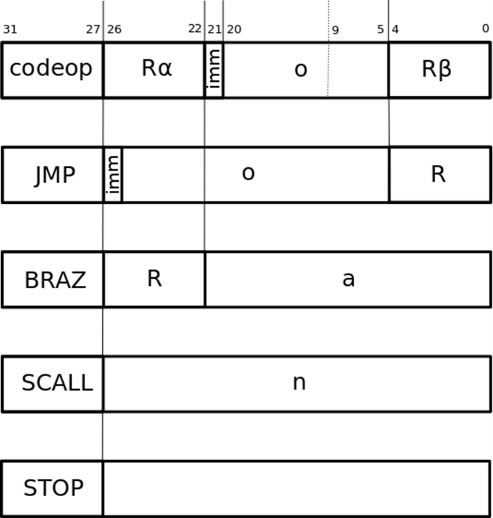

# Assembly
This Python package is meant to convert assembly programs into hexadecimal data exploitable by the Instruction Set Simulator.

## Instruction set
The following table presents the different keywords used in the custom assembly language used in this project.

_r_ is a register, _a_ is an integer and _o_ is either the number of the register or an integer.


|Hex value| Keyword      | Instruction                               |
|---|--------------|-------------------------------------------|
|0| stop         | stop the ISS                              |
|1| add r1,o,r2  | r2 gets r1+o                              |
|2| sub r1,o,r2  | r2 gets r1-o                              |
|3| mul r1,o,r2  | r2 gets r1*o                              |
|4| div r1,o,r2  | r2 gets r1//o                             |
|5| and r1,o,r2  | r2 gets r1 "and" o                        |
|6| or r1,o,r2   | r2 gets r1 "or" o                         |
|7| xor r1,o,r2  | r2 gets r1 "xor" o                        |
|8| shl r1,o,r2  | r2 gets r1 shifted to the left of o bits  |
|9| shr r1,o,r2  | r2 gets r1 shifted to the right of o bits |
|10| slt r1,o,r2  | r2 gets r1<o                              |
|11| sle r1,o,r2  | r2 gets r1<=o|                                  
|12| seq r1,o,r2  | r2 gets r1==o|
|13| load r1,o,r2 | r2 gets the content of the memory address r1+o|
|14| store r1,o,r2| r2 is written in the memory at the address r1+o|
|15| jmp o,r      | jump to address o and store it in r|
|16| braz r,a     | jump to address a if r==0|
|17| branz r,a    | jump to address a if r!=0|
|18| scall n      | system call n|

## System call
The only system call implemented in this Instruction Set are:
- 1: print on _stdout_ the value in _r1_
- 0: read from _stdin_ and store in _r1_

## Steps in assembly
The assembly is done in two steps:
- reformat the assembly code (remove comments, blank lines, etc.)
- translate to hexadecimal

Before the first step, the assembly code can look like this:
```assembly
# this code was written by Corentin Goetghebeur
add r0,3,r1; this stores 3 in the first register
add r0,6,r2
add r0,2,r3

sub r1,r2,r4
mul r3,r4,r1
scall 1 #this line prints r1 in the standard output


stop
```

After the first step of reformatting, it looks like this:
```assembly
add r0,3,r1
add r0,6,r2
add r0,2,r3
sub r1,r2,r4
mul r3,r4,r1
scall 1
stop
```

The hex number in front of the line represents the line number before the reformatting.
This step is necessary in order to keep the jumps to specific lines to the right place.

After the last step, the code will look like this:
```hex
0x0 0x8200061
0x1 0x82000c2
0x2 0x8200043
0x3 0x10400044
0x4 0x18c00081
0x5 0x90000001
0x6 0x0
```
TODO: finish the table when the code is written

## Binary Encoding

Each instruction is written in 32 bits:




## Tests and examples

This package contains tests and examples.
The Unit tests for this package (_testFormat.py_ and _testTranslation.py_) are built using the _unittest_ library in python.
The code coverage for these tests are 97% for the Format class and 94% for the Translation class.


